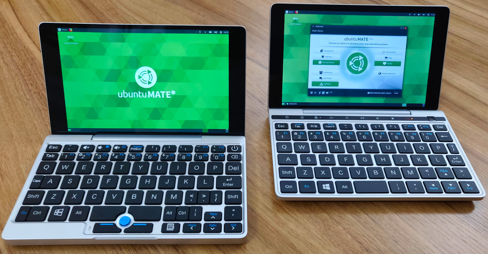

# GPD Pocket and GPD Pocket 2 hardware configuration for Ubuntu

Here are a couple of scripts for [GPD Pocket](https://gpd.hk/gpdpocket) and
[GPD Pocket 2](https://gpd.hk/gpdpocket2) Ubuntu users.

  * `gpd-pocket-ubuntu.sh`: install the required hardware configuration on a running Ubuntu install.
  * `gpd-pocket-ubuntu-respin.sh`: modify an existing Ubuntu .iso image with GPD specific hardware configuration.

The GPD Pockets were a very successful crowd funded netbook style laptops 
featuring a high resolution 7" touch display housed in an aluminium alloy 
body. The original GPD Pocket (2017) offered an Ubuntu pre-load option while 
the GPD Pocket 2 (2018) is available with Windows 10 only. These scripts for
the GPD Pockets is a continuation of the excellent work by
[Hans de Goede](https://hansdegoede.livejournal.com/),
[nexus511](https://apt.nexus511.net/), 
[stockmind](https://github.com/stockmind/gpd-pocket-ubuntu-respin) and many 
others.



## Pre-configured images

The Ubuntu MATE team offers a bespoke images for the
[GPD Pocket](https://gpd.hk/gpdpocket) and [GPD Pocket 2](https://gpd.hk/gpdpocket2)
that includes the hardware specific tweaks to get these devices working
*"out of the box"* without any faffing about.

  * <https://ubuntu-mate.org/download/>

## What works

The [Ubuntu MATE images](https://ubuntu-mate.org/gpd-pocket) for the GPD
Pocket and GPD Pocket 2 adds the following tweaks:

  * Enable **frame buffer and Xorg display rotation**.
    * Supports `modesetting` *and* `xorg-video-intel` display drivers.
  * Enable **TearFree rendering by default**.
  * Enable touch screen rotation for Xorg and Wayland.  
  * Enable **scroll while holding down the right track point button** for Xorg.
  * Enable double size console (tty) font resolution.
  * Enable **resolution scaling** for 1920x1200 displays. *(MATE Desktop only)*
    * Results in an effective resolution of 1280x800 to make the 7" panel easily readable.
    * Simple to disable if you want to full resolution.
  * **GRUB is usable post-install**.
    * GPD Pocket GRUB is rotated 90 degress, but functional.
    * GPD Pocket 2 GRUB is correctly rotated and functional.
  * GPD Pocket BRMC4356 WiFi firmware enabled by default.
  * GPD Pocket fan control kernel module enable by default.

## Known Issues

### GPD Pocket

  * The GRUB2 menu is rotated 90 degress on the GPD Pocket.
    * The workaround is to tilt your head.
  * The built in speaker in the GPD Pocket is mono and doesn't play audio from the right channel.
    * The workaround is two use headphones connected the 3.5mm audio jack.

### GPD Pocket 2

  * The boot menu is not displayed in the GPD Pocket 2 live media.
    * The workaround is to wait and the system will boot after a few seconds or press <kbd>Enter</kbd> to boot immeditately.
    * However, **GRUB is fully functional and usable post-install**.

### GPD Pocket & GPD Pocket 2

  * The Plymouth splash screen is not rotated on the GPD Pocket or GPD Pocket 2.
    * The workaround is to not care.

## The Scripts

**NOTE!** These scripts have been tested on
[Ubuntu MATE](https://ubuntu-mate.org) 18.04.2, 18.10 and 19.04. All Ubuntu
flavours should work although if you uses Wayland your mileage may vary.

### gpd-pocket-ubuntu.sh

Install one of the Ubuntu 18.04.2 (or newer) flavours on a GPD Pocket or GPD
Pocket 2 and run the following to inject the required hardware configuration.

```
git clone https://github.com/wimpysworld/gpd-pocket2-ubuntu.git
cd gpd-pocket2-ubuntu
sudo ./gpd-pocket-ubuntu.sh enable || disable
```

You must supply one of the following modes of operation

  * `enable`  : apply the GPD Pocket hardware configuration
  * `disable` : remove the GPD Pocket hardware configuration
  * `help`    : This help.

### gpd-pocket-ubuntu-respin.sh

```
git clone https://github.com/wimpysworld/gpd-pocket2-ubuntu.git
cd gpd-pocket2-ubuntu
```

  * Download an .iso image for one of the Ubuntu 18.04.2 (or newer) flavours.

```
sudo ./gpd-pocket-ubuntu-respin.sh -d gpd-pocket || gpd-pocket2 ubuntu-mate-18.04.2-desktop-amd64.iso
```

A new .iso will be created that includes the additional hardware tweaks
required by the GPD Pocket or GPD Pocket 2.

## Accessing GPD boot menus

### GPD Pocket

Switch the GPD Pocket on, immediately hold the <kbd>Fn</kbd> key and tapping the <kbd>F7</kbd> key until the Boot Manager screen appears.

### GPD Pocket 2

Switch the GPD Pocket 2 on, immediately hold the <kbd>Fn</kbd> key and tapping the <kbd>F12</kbd> key until the Boot Manager screen appears.