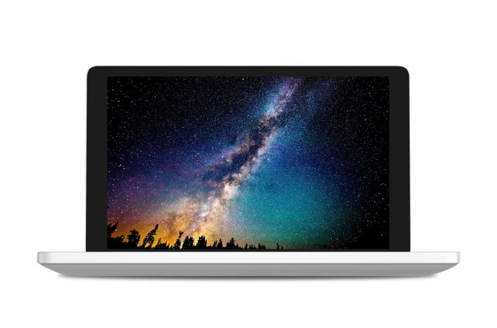

# GPD Pocket2 monitor and touchscreen configuration for Ubuntu

The is a simple script to install the required configuration to rotate the
monitor and touchscreen on Ubuntu for the [GPD Pocket2](https://www.indiegogo.com/projects/gpd-pocket2-7-0-umpc-laptop-win-10-os#/).

## Usage

    git clone https://github.com/wimpysworld/gpd-pocket2-ubuntu.git
    cd gpd-pocket2-ubuntu
    sudo ./gpd-pocket2-ubuntu.sh enable || disable

You must supply one of the following modes of operation

  * `enable`  : apply the GPD Pocket hardware configuration
  * `disable` : remove the GPD Pocket hardware configuration
  * `help`    : This help.

